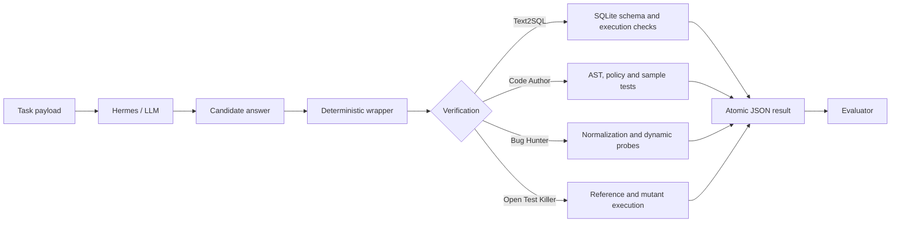

# Verifiable LLM Software Engineering Agents

結合大型語言模型與 deterministic verification 的 AI 軟體工程代理框架。專案重點不是做聊天機器人，而是把 LLM 產生的 SQL、Python 程式與 bug report 轉成可執行、可驗證、可重現的工程輸出。

## 30 秒摘要

- 主題：LLM agent reliability、程式驗證、mutation testing、Text2SQL。
- 核心成果：四個可執行 Skill，包含 Text2SQL、Code Author、Bug Hunter、Open Test Killer。
- 主要貢獻：Open Test Killer 會實際執行 reference implementation 與 mutants，建立 kill matrix，再用 exact search 或 deterministic greedy fallback 選出測試。
- 外部評分：AIASE 2026 期末專案總分 **91.38**，Basic Track **30/30**，Open Track **93.2/100**。
- 本地驗證：`192 passed, 1 skipped` 的 Pytest，加上 Skill self-tests、regression tests 與 repository verifier。

推薦履歷寫法：

> 建置可驗證的 LLM 軟體工程代理框架，結合 SQL validation、AST checks、dynamic probes 與 mutation testing；設計 Open Test Killer，以 execution-derived kill matrix 解 bounded maximum coverage，AIASE 2026 課程外部評測 Open Track 93.2/100、整體專題 91.38。

## 為什麼做這個

LLM 可以產生看起來合理的答案，但在軟體工程任務中常見問題包含：

- JSON contract 格式錯誤，evaluator 無法讀取。
- SQL 查詢引用不存在或 ambiguous 的 table/column。
- Python 程式語法正確但 sample test 或邊界案例失敗。
- Bug report 的行號、錯誤類型或修正建議與實際行為不一致。
- 模型用自然語言宣稱正確，但缺少可重跑的驗證證據。

本專案的設計原則是：模型負責語意理解，程式負責可以客觀檢查的部分。

## 系統架構



## 核心元件

| Component | Role | Verification |
|---|---|---|
| Text2SQL | 將自然語言問題轉成 SQLite query | read-only policy、schema validation、SQLite `EXPLAIN` |
| Code Author | 產生符合限制的 Python function | AST、entry point、SLOC、imports、sample execution |
| Bug Hunter | 找出 Python 程式中的具體錯誤 | report normalization、line checks、task oracles、dynamic probes |
| Open Test Killer | 選出能 kill mutants 的測試輸入 | process timeout、execution-derived kill matrix、exact/greedy selection |

## 主要技術貢獻：Open Test Killer

Open Test Killer 接收 reference code、mutants、candidate inputs 與 test budget，先執行 reference 得到 expected output，再執行每個 mutant 判斷 candidate 是否 kill 該 mutant。

Kill 條件：

- mutant 輸出與 reference 不同。
- mutant 丟出 exception，但 reference 成功。
- mutant timeout，但 reference 成功。

選取策略：

- candidate combinations 不超過 `25,000` 時使用 exact maximum-coverage search。
- 超出預算時使用 deterministic greedy fallback。
- matrix construction 受 `2,000` 次 evaluation call 與 global deadline 限制。
- `kill_rate >= 0.8` 且 evaluation 未被截斷時才輸出 pass verdict。

完整規格見 [`OPEN_TRACK.md`](OPEN_TRACK.md)。

## 成果證據

### 外部課程評測

| Track | Result |
|---|---:|
| Basic Track, Text2SQL | 30.0 / 30 |
| Pairwise Track, Bug Hunter | 8.33 / 10 |
| Open Track | 93.2 / 100 |
| Overall project score | 91.38 |

課程評語與分數來源見 [`AI_Review.md`](AI_Review.md)。老師端 private tasks 與 labels 未公開，因此 repository 無法重跑 private evaluation。

### 本地 deterministic verification

| Check | Result |
|---|---:|
| Root Pytest | 192 passed, 1 skipped |
| Code Author self-test | 45 passed, 0 failed |
| Bug Hunter self-test | 31 passed, 0 failed |
| Open Track self-test | 14 passed, 0 failed |
| Repository verifier | 27 / 27 |

### Public benchmark 摘要

| Scenario | Exact | Greedy | Random mean |
|---|---:|---:|---:|
| merge_intervals | 1.000 | 1.000 | 0.746 |
| top_k_frequent | 1.000 | 1.000 | 0.792 |
| valid_parentheses | 0.800 | 0.800 | 0.436 |

完整成果數字與限制見 [`docs/EVALUATION.md`](docs/EVALUATION.md)。

## 快速開始

需求：Python 3.11 以上。Hermes 只有在執行模型端到端評測時需要。

```bash
python -m venv .venv
source .venv/bin/activate
python -m pip install -r requirements.txt
python dev_set/basic/build_dbs.py
```

執行完整離線測試：

```bash
make test
```

使用 Docker 重現：

```bash
docker build -t verifiable-llm-se-agents .
docker run --rm verifiable-llm-se-agents
```

常用指令：

```bash
make selftest
make verify
make benchmark
make evidence
```

執行 Hermes/model 端到端開發評測：

```bash
python run_dev.py --skill text2sql-loweiwei --track basic
python run_dev.py --skill code-author-loweiwei --track pairwise --role code-author
python run_dev.py --skill bug-hunter-loweiwei --track pairwise --role bug-hunter
```

Hermes 設定範例位於 [`docs/hermes-config.example.yaml`](docs/hermes-config.example.yaml) 與 [`docs/hermes-env.example`](docs/hermes-env.example)。不要提交真實 token。

## Repository Layout

```text
skills/                  四個個人 Skill 與課程 reference fixtures
dev_set/                 課程提供的 public development tasks
tests/                   deterministic test suite
scripts/                 benchmark、ablation、evidence scripts
artifacts/               可重現的驗證與 benchmark 摘要
docs/                    技術報告、評測說明、環境與貢獻來源
run_dev.py               Hermes end-to-end development evaluator
verify_repo.py           repository contract verifier
OPEN_TRACK.md            Open Test Killer 完整規格
AI_Review.md             AIASE 2026 課程評閱回饋
report.md                原始課程專題報告
```

## 保留文件

| Document | Purpose |
|---|---|
| [`docs/TECHNICAL_REPORT.md`](docs/TECHNICAL_REPORT.md) | 完整技術報告 |
| [`docs/EVALUATION.md`](docs/EVALUATION.md) | 成果數字來源、限制與 claims policy |
| [`docs/ENVIRONMENT.md`](docs/ENVIRONMENT.md) | Python、Hermes、Docker 環境說明 |
| [`docs/CONTRIBUTIONS.md`](docs/CONTRIBUTIONS.md) | 個人實作、課程素材與 AI 工具使用說明 |
| [`SECURITY.md`](SECURITY.md) | 安全限制與 responsible use |

## 限制

- Public development tasks 曾用於開發與調整，不能視為 held-out benchmark。
- 老師 private evaluation 只提供 aggregate evidence，private tasks 與逐題 labels 無法公開重跑。
- Portfolio branch 的後續整理尚未接受同一套 private re-evaluation。
- Child-process limits 可降低 runaway code 風險，但不是完整 security sandbox。
- 端到端模型結果可能受 provider、模型版本與 Hermes 設定影響。
