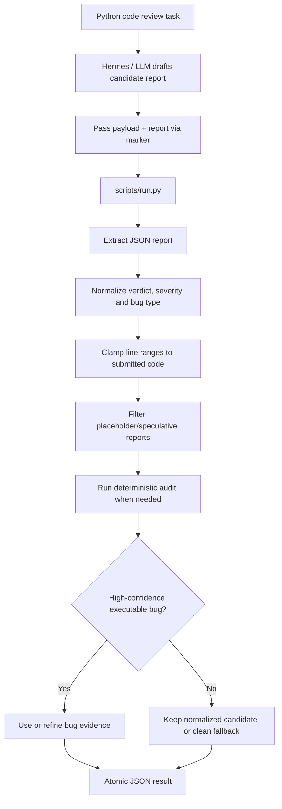

# Bug Hunter Skill

`bug-hunter-loweiwei` 負責審查 Python code，輸出具體、可定位、可修正的 bug report。這個 Skill 的設計偏 conservative：寧可少報，也避免在 clean code 上亂報；同時用 deterministic dynamic probes 補強明顯可觸發的 bug。

## 目標

- 輸入：`task_id`、`task_description`、`code`，以及可能存在的 constraints。
- 輸出：`task_id`、`verdict`、`bugs`、`confidence`。
- 每個 bug 包含：`line_start`、`line_end`、`severity`、`type`、`description`、`suggested_fix`。
- 行號以輸入 `code` 字串為準，1-indexed，包含空行與註解。

## 流程架構

## 主要方法

- `SKILL.md` 要求 Hermes 先分析 code，再把候選 bug report 傳給 `scripts/run.py`。
- `run.py` 會抽取 JSON、修正 enum、限制 bug 數量、clamp line range。
- Normalizer 會過濾 placeholder report、self-negating report、過度 speculative report、不可能的 control-flow claim。
- Dynamic audit 會解析 AST、推測 entry point，並用 task-specific probes 或 metamorphic checks 找可執行證據。
- 對已知 task family，deterministic probes 可修正 line/type，例如 binary search boundary、merge intervals empty input、dedup/kth-smallest、CSV parsing、DP recurrence 等模式。

## 決策策略

- 如果 LLM report 合理且具體，先正規化後保留。
- 如果 report 缺失、格式錯誤或信心不足，會回到 clean fallback 或 deterministic audit。
- 如果 deterministic audit 找到高信心、可觸發的 bug，會用 audit evidence 補強或修正候選 report。
- High-confidence clean report 不會隨意覆蓋，以維持低 false positive 的策略。

## 安全與資源控制

Bug Hunter 需要執行待審 code 的 probes，因此使用與 Code Author 類似的 worker isolation：

- restricted builtins/import allowlist。
- temporary directory 與縮小 environment。
- per-probe timeout。
- CPU/memory/file/process limits。
- 捕捉 stdout/stderr。
- timeout 或 crash 不會中斷主 evaluator。

## 已知限制

- 它不是完整形式化驗證器，仍可能漏掉需要複雜語意理解或長測資才能觸發的 bug。
- Line/type 修正依賴目前實作的 task-family probes，不代表能涵蓋所有 Python bug 類型。
- `scripts/analyze.py` 是 legacy debug helper，正式流程以 `scripts/run.py` 為準。

## 重要檔案

| File | Purpose |
|---|---|
| `skills/bug-hunter-loweiwei/SKILL.md` | Bug Hunter agent 使用規則 |
| `skills/bug-hunter-loweiwei/scripts/run.py` | report normalization、dynamic audit、result contract |
| `skills/bug-hunter-loweiwei/scripts/selftest.py` | 31 個 self-test scenarios |
| `skills/bug-hunter-loweiwei/scripts/regression.py` | reference clean/buggy/tricky regression |
| `tests/test_extract_contract.py` | JSON extraction 與 contract parsing 測試 |
