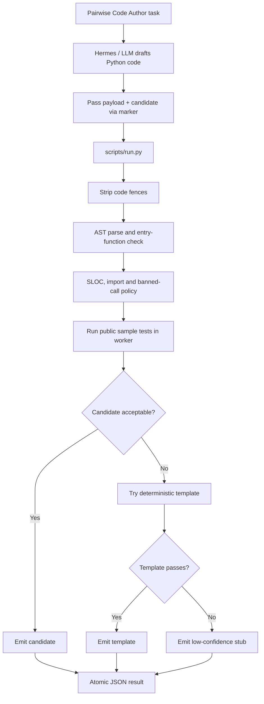

# Code Author Skill

`code-author-loweiwei` 負責為 Pairwise Code Author 任務產生 Python function。它採用 candidate-first 設計：先讓 LLM 產生候選程式，再由 deterministic wrapper 檢查 AST、entry point、SLOC、imports、安全限制與 public samples。

## 目標

- 輸入：`task_id`、`task_description`、`constraints`，以及可能存在的 sample tests。
- 輸出：`task_id`、`code`、`loc`、`self_test_results`、`rationale`、`confidence`。
- 正式輸出位置：優先寫入 `AIASE_RESULT_PATH`。
- 任務重點：產生符合限制、可執行、能通過 public samples 的 Python function。

## 流程架構

## 主要方法

- `SKILL.md` 要求 Hermes 先私下寫候選 code，再呼叫 `scripts/run.py` 一次。
- 多行 Python code 透過 `__AIASERUN_CANDIDATE_CODE_V1__` marker 傳入，避免 CLI argument quoting 問題。
- `run.py` 會移除 Markdown code fences，確保 evaluator 不會收到 fenced Python。
- AST validation 檢查語法、required entry function、unsafe top-level statements。
- Policy checks 限制 SLOC、imports、危險呼叫與不適合 evaluator 的副作用行為。
- Sample execution 會在 child worker 中執行，驗證候選程式是否符合 public examples。
- 若候選程式失敗，才考慮 deterministic templates；這避免一開始就忽略 LLM 的語意推理能力。

## 安全與資源控制

候選程式不是在主程序中直接執行，而是在受限制 worker 裡跑：

- 使用 temporary working directory。
- 清空或縮小 environment。
- 設定 CPU、memory、file size、file descriptor、core dump 等限制。
- 每個 sample case 有 timeout。
- 捕捉 stdout/stderr，避免雜訊污染正式 JSON。
- timeout 時終止 process group。

這些限制可以降低 runaway code 的風險，但不宣稱是完整 security sandbox。

## Fallback 策略

- 候選 code 通過 static checks 與 samples 時，優先採用候選 code。
- 候選失敗時，依 task family 嘗試 deterministic template。
- 若沒有可用 template，輸出低信心 stub：`def solution(*args): return None`。

## 重要檔案

| File | Purpose |
|---|---|
| `skills/code-author-loweiwei/SKILL.md` | Code Author agent 使用規則 |
| `skills/code-author-loweiwei/scripts/run.py` | candidate validation、sample execution、fallback selection |
| `skills/code-author-loweiwei/scripts/selftest.py` | 45 個 self-test scenarios |
| `skills/code-author-loweiwei/scripts/regression.py` | reference task regression |
| `tests/test_worker_isolation.py` | worker isolation 與 timeout/resource behavior 測試 |
