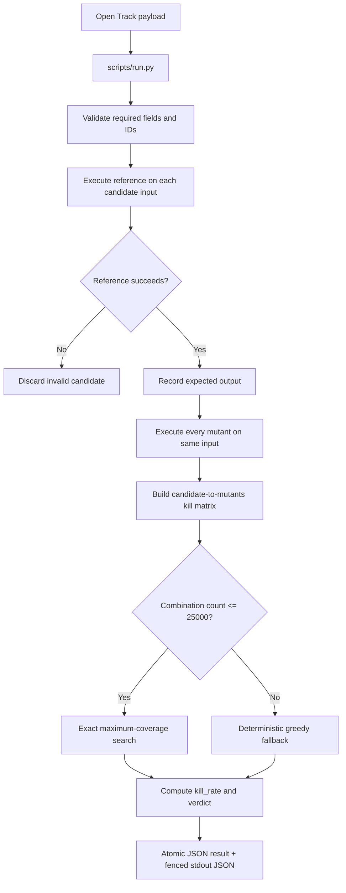

# Open Test Killer Skill

`open-test-killer-loweiwei` 是這個專案的 mutation-testing track。給定 reference implementation、mutants、candidate inputs 與 test budget，它會實際執行程式、建立 kill matrix，然後選出在預算內能 kill 最多 mutants 的測試。

## 目標

- 輸入：`task_id`、`entry_point`、`reference_code`、`mutants`、`candidate_inputs`、`max_tests`。
- 輸出：`ok`、`selected_tests`、`killed_mutants`、`unkilled_mutants`/`survived_mutants`、`kill_rate`、`verdict`、`confidence`、`rationale`、`evaluation_stats`。
- 核心原則：kill set 由實際執行推導，不由 LLM 自行宣稱。

## 流程架構

## Kill 規則

Candidate input 對某個 mutant 的 kill 成立條件：

- reference 成功，mutant 回傳不同結果。
- reference 成功，mutant 丟出 exception。
- reference 成功，mutant timeout。
- reference 成功，mutant 輸出無法 JSON-normalize。

如果 reference 對 candidate input 失敗，該 candidate 不列入有效測試。

## 測試選擇策略

### Exact Search

- 當候選組合數不超過 `25,000` 時，枚舉所有可行組合。
- 目標是最大化 killed mutants 數量。
- Tie-break 順序：kill 數多、使用測試數少、candidate 原始順序穩定。

### Greedy Fallback

- 當組合數超過 exact budget 時，改用 deterministic greedy。
- 每一步選擇能新增最多 kill 的 candidate。
- Tie-break 使用穩定順序，確保相同輸入重跑會得到相同輸出。

### Verdict

- `kill_rate >= 0.8` 且 evaluation 沒有 truncated 時，`verdict` 才是 `pass`。
- 如果超過 global deadline 或 `MAX_EVAL_CALLS=2000`，會標記 truncation，避免把不完整搜尋包裝成完整通過。

## 為什麼這個結果可驗證

這個 Skill 把「測試是否有效」從模型主觀判斷改成 execution-derived evidence。`selected_tests` 裡的 expected output 來自 reference execution；每個 selected test 的 `kills` 來自 mutant execution；最後的 `kill_rate` 可以被另一個 verifier 重新執行檢查。

## Public Scenarios

目前 self-test 覆蓋：

- `merge_intervals`
- `valid_parentheses`
- `top_k_frequent`
- candidate/mutant order perturbation
- typing import 與 class definition
- exact-search greedy trap
- mutant id rename
- verdict threshold
- truncated verdict

## 重要檔案

| File | Purpose |
|---|---|
| `skills/open-test-killer-loweiwei/SKILL.md` | Open Track agent 使用規則 |
| `skills/open-test-killer-loweiwei/scripts/run.py` | mutation execution、kill matrix、selection algorithm |
| `skills/open-test-killer-loweiwei/scripts/selftest.py` | 14 個 self-test scenarios |
| `skills/open-test-killer-loweiwei/scripts/regression.py` | Open Track regression entry |
| `skills/open-test-killer-loweiwei/scripts/public_scenarios/` | public development scenarios |
| [`OPEN_TRACK.md`](../../OPEN_TRACK.md) | Open Track 完整輸入、輸出與評分規格 |
