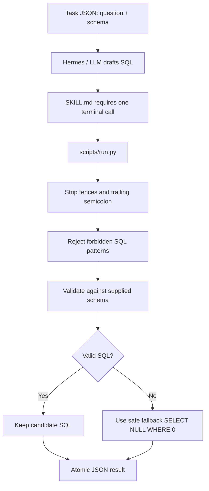

# Text2SQL Skill

`text2sql-loweiwei` 負責把自然語言問題與 SQLite schema 轉成一條可驗證的 read-only SQL。它不是直接相信 LLM 寫出的 query，而是讓 `scripts/run.py` 做格式清理、語法檢查、schema 檢查與安全 fallback。

## 目標

- 輸入：`task_id`、`question`、`db_schema`、`dialect`。
- 輸出：`task_id`、`sql`、`rationale`、`confidence`。
- 正式輸出位置：優先寫入 `AIASE_RESULT_PATH`，否則寫入目前目錄的 `aiase_result.json`。
- 任務限制：只允許單一 SQLite read-only `SELECT` query。

## 流程架構



## 主要方法

- `SKILL.md` 要求 Hermes 只做候選 SQL 推理，不直接輸出最終 JSON。
- 候選 SQL 透過 delimiter protocol 傳給 `scripts/run.py`，避免 shell quoting 破壞 schema 或 query。
- `run.py` 會移除 Markdown fences、清理 optional trailing semicolon，並拒絕 empty SQL。
- `run.py` 拒絕 non-`SELECT`、multiple statements、DDL、DML、`PRAGMA`、transaction、`WITH`、recursive/window constructs。
- 提供 schema 時，優先使用 `validate_sql.validate()`；若 helper import 失敗，會用 in-memory SQLite `EXPLAIN` 作為 fallback validation。
- SQL keyword 掃描會避開字串與註解，降低把 SQL 字串內容誤判成危險語法的機率。

## Fallback 策略

如果候選 SQL 不合法，正式輸出改成：

```sql
SELECT NULL WHERE 0
```

這個 fallback 的目的不是回答問題，而是避免 evaluator 收到不可執行或具副作用的 SQL。`confidence` 會降低，`rationale` 會說明 fallback 原因。

## 為什麼這樣設計

Text2SQL 的主要風險不是只有語意答錯，也包含引用不存在欄位、產生多 statement、混入 DML/DDL 或輸出 Markdown 導致 evaluator 解析失敗。這個 Skill 把「query 是否可執行且符合 read-only policy」交給 deterministic code 檢查，讓錯誤至少被轉成可控、可重現的低信心輸出。

## 重要檔案

| File | Purpose |
|---|---|
| `skills/text2sql-loweiwei/SKILL.md` | Hermes 使用規則與輸出 contract |
| `skills/text2sql-loweiwei/scripts/run.py` | SQL 清理、驗證、fallback、atomic result write |
| `skills/text2sql-loweiwei/scripts/validate_sql.py` | schema-aware SQL validation helper |
| `tests/test_validate_sql.py` | SQL validation 行為測試 |
| `tests/test_bag_equality.py` | Text2SQL result comparison helper 測試 |
